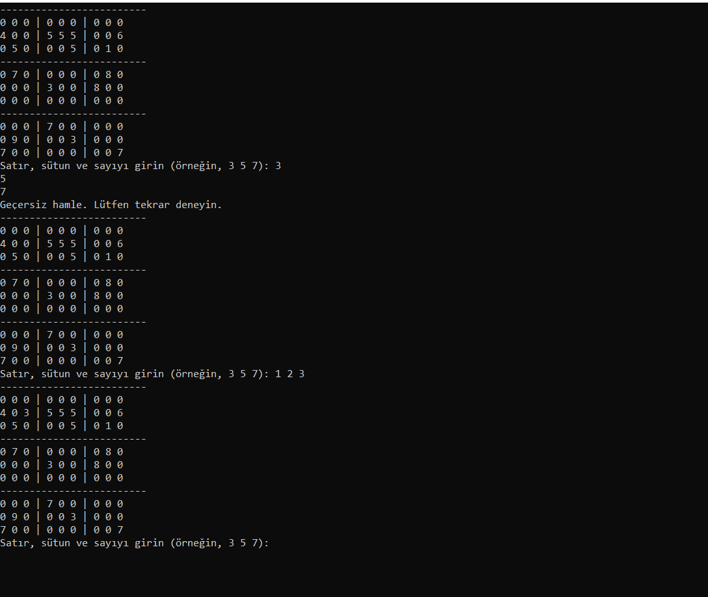

# cpp-sudoku

Bu C++ programı, kullanıcıya bir Sudoku oyunu oynama imkanı sunan basit bir konsol uygulamasını içerir. Sudoku oyununun temel mantığına dayalı olarak, oyuncu boş hücrelere doğru sayıları yerleştirerek oyunu tamamlamaya çalışır. İşte bu programın detaylı açıklaması:

# `Sudoku` Sınıfı
- `board`: 9x9'luk Sudoku tahtasını temsil eden bir vektör.
- `initializeBoard()`: Sudoku tahtasını başlatan ve rastgele sayılarla dolduran bir fonksiyon.
- `displayBoard()`: Sudoku tahtasını ekrana yazdıran bir fonksiyon.
- `getUserMove()`: Kullanıcıdan hamle bilgilerini alan bir fonksiyon.
- `isValidMove()`: Girilen hamlenin geçerli olup olmadığını kontrol eden bir fonksiyon.
- `isNumValidInRow()`, `isNumValidInCol()`, `isNumValidInBox()`: Sırasıyla, satır, sütun ve kutu içinde bir sayının geçerli olup olmadığını kontrol eden yardımcı fonksiyonlar.
- `placeNumber()`: Belirtilen konuma bir sayı yerleştiren bir fonksiyon.
- `isSudokuSolved()`: Sudoku tahtasının tamamlandığını kontrol eden bir fonksiyon.
- `playGame()`: Oyunu başlatan ve kullanıcının oyunu tamamlamasını sağlayan ana oyun döngüsünü içeren fonksiyon.

# `Main` Fonksiyonu
- `main()` fonksiyonu, `Sudoku` sınıfını kullanarak bir Sudoku oyunu başlatır ve oyunu tamamlamak için kullanıcının hamlelerini bekler.

**Bu uygulama, C++ dilinde basit bir Sudoku oyununu simüle eder ve temel Sudoku kurallarına uygunluğunu kontrol ederek kullanıcıya interaktif bir oyun deneyimi sunar.**

# Ekran Resmi

# Bilgilendirme
**---------------------------------------------------------**
| Herkese Açık | Geliştirilebilir | Zyra Software|
|---------|---------|---------|
| Açık | Geliştirilebilir |@zyrasoftware |
